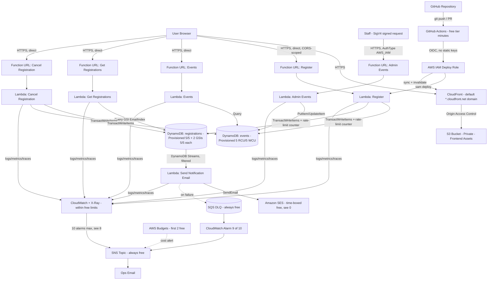

# Event Registration & Ticketing System — Backend Architecture Specification
### Serverless AWS Design — Free-Tier-Only Edition (v3)

---

## 0. How to Use This Document

This is an implementation-ready specification for the **backend and infrastructure** of the Event Registration & Ticketing System, constrained so every AWS resource stays inside AWS's Free Tier. It is written for an AI coding agent (e.g. Antigravity, Claude Code, Cursor) to execute against — every contract, schema, and IAM permission below is meant to be implemented literally.

- **Frontend is already built** (HTML/CSS/JS per the existing UI/UX spec). This revision changes how the frontend talks to the backend (see §3's frontend integration note) but not its visual design.
- §0 explains the free-tier constraint itself and what changed to enforce it.
- §1–§10 are the full technical spec.
- §11 is the ordered build checklist.

### Free Tier Constraint — Read This First

Two nuances materially affect what "free" means here, both confirmed against AWS's current pricing pages:

1. **Account age changes what "free" means.** AWS restructured its Free Tier on July 15, 2025. Accounts created **before** that date run on the legacy model: an **Always Free** category with permanent monthly allowances that never expire, plus a separate **12-months-free** category (S3, the old API Gateway/SES allowances, etc.) that expires on the account's first birthday. Accounts created **after** that date instead get a one-time $100–$200 signup credit that lasts 6 months (or until spent); the old 12-months-free services now draw down that credit rather than having their own allowance. **The Always Free category itself is identical for both account types and never expires.** This spec is built almost entirely from that Always Free list, specifically so it works the same way regardless of when the AWS account was created.
2. **One service here has no permanent free allocation: Amazon SES**, used for confirmation/cancellation emails. It's free for 12 months (legacy accounts) or covered by the signup credit (new accounts), then costs $0.10 per 1,000 emails. At this system's expected volume (well under 1,000 emails/month), that's a few cents a month, not zero. §6.6 and §11 spell out the exact number and a genuinely-$0-forever alternative if even that isn't acceptable.

Everything else in this design — Lambda (including Function URLs), DynamoDB in provisioned mode, CloudFront, SNS, SQS, CloudWatch within limits, X-Ray within limits — is on AWS's permanent Always Free list.

**Shared-budget caveat:** Free Tier allowances (DynamoDB's 25 RCU/25 WCU, CloudWatch's 10 alarms, etc.) apply **per AWS account/region**, not per application. If this account already runs other DynamoDB tables or CloudWatch alarms — including leftovers from AWS's own tutorials — those already eat into the same budget this spec allocates. Check current usage on the Free Tier dashboard before deploying, and reduce §4/§8's numbers accordingly if so.

### What Changed From the Previous Revision (to enforce free-tier-only)

| Area | Previous Revision | This Revision | Why |
|---|---|---|---|
| API layer | Amazon API Gateway (REST API) | **Lambda Function URLs** — one HTTPS endpoint per function, no API Gateway | API Gateway's REST API free tier is time-boxed to 12 months (or covered by the 6-month signup credit) — it is **not** Always Free. Function URLs are a native Lambda feature billed as part of standard Lambda pricing, so they inherit Lambda's Always Free allowance. |
| DynamoDB billing | On-demand (`PAY_PER_REQUEST`) | **Provisioned capacity**, fixed at 25 RCU / 25 WCU total across both tables and their GSIs, auto scaling disabled | DynamoDB's Always Free allocation (25 GB storage, 25 RCU, 25 WCU) only applies to **provisioned** mode. On-demand mode has no free allocation — it bills from the first request, regardless of volume. |
| Abuse / bot protection | AWS WAF | DynamoDB-backed rate limiting inside Lambda + a honeypot form field | AWS WAF has **no free tier at all** — a flat ~$5/month WebACL fee plus per-rule and per-request charges apply from the first request. |
| Custom domain | CloudFront + Route 53 + ACM (optional) | Default CloudFront (`*.cloudfront.net`) and Function URL domains | Route 53 hosted zones cost $0.50/month with no free tier. The default AWS domains are HTTPS out of the box at no cost. |
| Admin auth | API Gateway API key + usage plan | Function URL `AuthType: AWS_IAM` (SigV4-signed requests only) | API keys/usage plans are an API Gateway feature. Without API Gateway, IAM auth on the Function URL is the native free equivalent — and arguably stronger than a static key. |
| CloudWatch Alarms | ~11 alarms across all functions/tables | Trimmed to exactly 10 | CloudWatch's Always Free allocation is exactly 10 alarms; an 11th bills per-alarm per month. §8 lists the prioritized set. |
| S3 (frontend hosting) | Used without comment | Kept, but explicitly flagged as **time-boxed**, not Always Free | No AWS substitute exists for static asset storage. Flagged so it isn't mistaken for a permanent-free choice — though real-world cost for a few MB of HTML/CSS/JS after the free period is a fraction of a cent per month. |

### Assumptions (unchanged)
- Events are free to attend — no payment processing in scope.
- A small number of trusted staff manage events; a full admin UI is out of scope (the admin API in §3.5 is the interim approach).
- Expected scale is low-to-moderate (hundreds to low thousands of registrations/month) — the free-tier ceilings below are sized for that, not for viral-scale traffic.

### Out of Scope
Payment processing, refunds, multi-tenant support, native mobile apps, an admin UI (only the admin API is specified).

---

## 1. High-Level Architecture



---

## 2. AWS Services Used

| Service | Purpose | Free Tier Category |
|---|---|---|
| S3 | Private frontend asset storage | Time-boxed (12 mo. legacy / credit-covered new) — real cost after is near-zero at this asset size |
| CloudFront | CDN + HTTPS for the frontend, default domain | **Always Free** — 1 TB data out + 10M requests/month |
| Lambda + Function URLs | All business logic and every public HTTPS endpoint | **Always Free** — 1M requests + 400,000 GB-seconds/month |
| DynamoDB (provisioned) | `events` + `registrations` tables | **Always Free** — 25 GB storage, 25 RCU, 25 WCU, shared across tables/GSIs (see §4) |
| DynamoDB Streams | Triggers the notification Lambda | No separate charge at this volume |
| Amazon SES | Confirmation / cancellation emails | Time-boxed (3,000 msgs/mo for 12 mo. legacy / credit-covered new); ~$0.10/1,000 after — see §0 |
| SQS | Dead-letter queue for the notification Lambda | **Always Free** — 1M requests/month |
| CloudWatch | Logs, metrics, 10 alarms | **Always Free within limits** — 10 alarms, 10 custom metrics, 5 GB log ingestion/month |
| X-Ray | Distributed tracing | **Always Free** — 100,000 traces recorded/month |
| SNS | Ops alerts to a pre-subscribed static address | **Always Free** — 1M publishes + 1,000 email notifications/month |
| IAM | Roles/policies, GitHub OIDC identity provider | No charge, ever |
| AWS Budgets | Cost-threshold alerting | First 2 budgets free |
| AWS SAM / CloudFormation | Infrastructure as Code | No charge for the tooling itself |

**Removed** vs. the previous revision — each had no permanent free allocation: **API Gateway** (replaced by Function URLs), **AWS WAF** (replaced by application-level rate limiting, §5), **Route 53 / ACM custom domain** (replaced by default AWS domains).

---

## 3. API Specification

Every route, request/response body, status code, and error shape below is **unchanged** from a conventional API-Gateway design — only the transport changed, from one API Gateway base path to five independent Lambda Function URLs.

### Frontend integration note
Each function now has its own endpoint, shaped like `https://<url-id>.lambda-url.<region>.on.aws/`. The frontend needs a small config update — five URLs instead of one base path — with no visual or UX changes:
```js
// frontend/config.js
export const ENDPOINTS = {
  register:      "https://<url-id-1>.lambda-url.<region>.on.aws/",
  events:        "https://<url-id-2>.lambda-url.<region>.on.aws/",
  registrations: "https://<url-id-3>.lambda-url.<region>.on.aws/", // append /{email}
  cancel:        "https://<url-id-4>.lambda-url.<region>.on.aws/", // append /{registrationId}
};
```
These URLs are only known after the first `sam deploy` (they're generated, not chosen) — write them into the frontend config as a deploy-pipeline step (§9), not hardcoded.

Shared error shape:
```json
{ "error": { "code": "EVENT_FULL", "message": "This event has reached capacity." } }
```

### 3.1 `POST /` on the Register Function URL — registers an attendee
**Body:** `{ "eventId": "EVT001", "name": "Rebecca Batoh", "email": "participant@email.com" }`
**Validation:** `eventId` required; `name` required, 1–100 chars; `email` required, valid format, normalized to lowercase.

| Status | Condition | Body |
|---|---|---|
| 201 | Success | `{ "registrationId", "eventId", "status": "CONFIRMED" }` |
| 400 | Validation failure | `error.code = "INVALID_INPUT"` |
| 404 | `eventId` doesn't exist | `error.code = "EVENT_NOT_FOUND"` |
| 409 | Event at capacity | `error.code = "EVENT_FULL"` |
| 409 | Email already registered for this event | `error.code = "DUPLICATE_REGISTRATION"` |
| 429 | Rate limit exceeded (§5) | `error.code = "TOO_MANY_REQUESTS"` |
| 500 | Unhandled error | `error.code = "INTERNAL_ERROR"` |

### 3.2 `GET /` on the Events Function URL — lists events with live availability
**200:** `{ "events": [ { "eventId", "eventName", "date", "location", "capacity", "registeredCount", "status" } ] }`. `status` is derived server-side: `"Available"` if `registeredCount < capacity`, else `"Full"` (or the stored `"Cancelled"`).

### 3.3 `GET /{email}` on the Registrations Function URL — lookup by email
**200:** `{ "registrations": [ { "registrationId", "eventId", "eventName", "registrationDate", "status" } ] }`, newest first. An empty array is a valid 200, not a 404.

### 3.4 `DELETE /{id}` on the Cancel Function URL — idempotent cancellation
| Status | Condition | Body |
|---|---|---|
| 200 | Cancelled now, or already cancelled (no-op) | `{ "registrationId", "status": "CANCELLED" }` |
| 404 | `registrationId` doesn't exist | `error.code = "REGISTRATION_NOT_FOUND"` |

### 3.5 `POST /` and `PUT /{eventId}` on the Admin Events Function URL
Creates/updates an event — nothing in the original diagram ever populated the Events table at all, so this closes that gap.
- **Auth:** Function URL `AuthType: AWS_IAM`. Give one dedicated staff IAM principal `lambda:InvokeFunctionUrl` on this function's ARN only — no one else can call it, and it needs no secret to rotate.
- Body: `{ "eventId", "eventName", "date", "location", "capacity" }`. `registeredCount` defaults to `0` on create and is never client-settable — it's only ever mutated by the transactional register/cancel flows in §6.

### CORS
Every public Function URL (Register, Events, Registrations, Cancel) has native CORS configured directly on the Function URL resource: `AllowOrigins` set to the CloudFront domain, `AllowMethods` per route, `AllowHeaders: [content-type]`. No OPTIONS-handling code needed in Lambda — Function URLs answer preflight automatically once CORS is configured. The Admin Function URL has no CORS configuration (it's never called from a browser).

---

## 4. DynamoDB Schema

Billing mode: **`PROVISIONED`**, not on-demand — required to land in DynamoDB's Always Free allocation. That allocation (25 GB storage, 25 RCU, 25 WCU) is **shared across every table and GSI in the account/region**, not granted per table.

**Capacity plan** (20/20 used, 5/5 headroom against the 25/25 ceiling):

| Table / Index | RCU | WCU |
|---|---|---|
| `events` (base table) | 5 | 5 |
| `registrations` (base table) | 5 | 5 |
| `registrations` → `EmailIndex` (GSI) | 5 | 5 |
| `registrations` → `EventIndex` (GSI) | 5 | 5 |
| **Total** | **20** | **20** |
| Free tier ceiling | 25 | 25 |

**Do not enable Auto Scaling.** Auto Scaling raises capacity above these numbers under load, and anything above the shared 25/25 ceiling bills at standard provisioned rates. Fixed capacity means a real traffic spike returns `ProvisionedThroughputExceededException` (the AWS SDK retries this with exponential backoff automatically) instead of a bill — the correct trade-off for a strictly-free build at this project's expected volume. If sustained throttling becomes a genuine problem, that's a deliberate decision to move to paid on-demand billing, not something to silently auto-scale into.

### 4.1 `events` table
Partition key: `eventId` (S). Attributes: `eventName` (S), `date` (S, ISO-8601), `location` (S), `capacity` (N), `registeredCount` (N), `status` (S: `Available`/`Full`/`Cancelled`), `createdAt`/`updatedAt` (S).

### 4.2 `registrations` table
Partition key: `registrationId` (S). Attributes: `eventId` (S), `eventName` (S, denormalized), `name` (S), `email` (S, lowercase), `registrationDate` (S, ISO-8601), `status` (S: `CONFIRMED`/`CANCELLED`), `itemType` (S: `REGISTRATION`), `createdAt`/`updatedAt` (S).

**Registration ID format:** `REG-<uuid4>` — guarantees no collisions without a coordination step. (Diverges from the sample `REG12345`; use a ULID instead if a shorter, sortable ID is preferred for support lookups — don't use a simple incrementing counter, which needs its own atomic-counter item for no real benefit here.)

**GSIs:**
- **`EmailIndex`** — PK `email`, SK `registrationDate`. Powers `GET /registrations/{email}`.
- **`EventIndex`** — PK `eventId`, SK `registrationId`. Powers admin/ops queries; not on the hot path (capacity is tracked by the atomic counter on `events`, not by counting this index).

**Uniqueness / idempotency — the "lock item" pattern.** Every successful registration also writes a second item in the same table: `registrationId = "LOCK#<eventId>#<email>"`, `itemType = "LOCK"`. Written in the same transaction as the real registration, conditioned on `attribute_not_exists(registrationId)` — a second attempt for the same event+email collides and fails with `409 DUPLICATE_REGISTRATION`. Lock items deliberately omit the `email` and `eventId` attributes so they never appear in `EmailIndex`/`EventIndex` (GSIs only index items that carry the GSI's key attribute). On cancellation, the lock item is deleted, freeing the email to register again later.

**Rate-limit items (new, see §5):** `registrationId = "RATE#<sourceIp>#<yyyy-MM-ddTHH:mm>"`, one-minute buckets, with a DynamoDB TTL attribute so expired buckets are deleted automatically at no cost. These also omit `email`/`eventId` for the same reason as lock items.

---

## 5. Abuse / Rate-Limiting (replaces AWS WAF)

AWS WAF has no free tier at all, so bot/abuse protection on the public registration form is implemented in application code using only Always-Free services:

- **Honeypot field:** the (already-built) registration form can include a hidden field real users never fill in. If it's non-empty on submit, the Register Lambda returns a fake `201` success without writing anything — a bot scraping responses can't tell it was rejected.
- **DynamoDB-backed rate limiting:** the Register Lambda increments a per-IP counter item (`RATE#<sourceIp>#<minute-bucket>`, per §4.2) via `UpdateItem` with `ADD count :one`, and a short TTL so DynamoDB deletes it automatically. If the current window exceeds a threshold (e.g. 10 requests/minute/IP), return `429 TOO_MANY_REQUESTS` before starting the real transaction. This reuses the `registrations` table's existing 5/5 capacity budget from §4 — no new resource, no new cost.
- This is blunter than WAF's managed rule sets (no bad-signature detection, no CAPTCHA) — the honest trade-off of staying inside the free tier. If spam becomes a real problem, a free third-party option like Google reCAPTCHA v3 or hCaptcha on the frontend form is a reasonable next step at $0 — it's a third-party service, not AWS, so it's outside this document's scope but worth knowing about.

---

## 6. Lambda Functions

Runtime: **Python 3.13** (or the latest generally available Lambda runtime) for all functions, each with **its own IAM role** — no shared "backend role." All functions share a common Lambda **Layer** (`backend/common/`): a DynamoDB client wrapper, a response/error builder matching §3's error shape, input validation helpers, the rate-limit check from §5, and structured logging (recommend `aws-lambda-powertools`).

### 6.1 `backend/register/lambda_function.py`
- Trigger: Register Function URL (`AuthType: NONE`, CORS-scoped)
- Checks the rate-limit counter (§5) first; returns `429` early if exceeded.
- Validates input → normalizes email → generates `registrationId` → single `TransactWriteItems` call:
  1. `Update` on `events`: `SET registeredCount = registeredCount + :one` where `ConditionExpression = "registeredCount < capacity"`
  2. `Put` on `registrations`: the registration item, `ConditionExpression = "attribute_not_exists(registrationId)"`
  3. `Put` on `registrations`: the lock item, same condition
- Passes a deterministic `ClientRequestToken` (hash of `eventId + email`) so a client-side retry of the same request is idempotent at the AWS API level, not just in application logic.
- On `TransactionCanceledException`, inspects `CancellationReasons` to map the failure to `EVENT_FULL` vs `DUPLICATE_REGISTRATION` rather than returning a generic error.
- **IAM:** `dynamodb:UpdateItem`, `dynamodb:GetItem` on `events`; `dynamodb:PutItem`, `dynamodb:UpdateItem` on `registrations` — exact table ARNs only.

```text
# Pseudocode — the transactional core
transact_write_items(
  ClientRequestToken = sha256(eventId + "#" + email),
  TransactItems = [
    { Update: { Table: events, Key: {eventId}, UpdateExpr: "SET registeredCount = registeredCount + :one",
                ConditionExpr: "registeredCount < capacity" } },
    { Put: { Table: registrations, Item: registrationItem,
             ConditionExpr: "attribute_not_exists(registrationId)" } },
    { Put: { Table: registrations, Item: lockItem,
             ConditionExpr: "attribute_not_exists(registrationId)" } },
  ]
)
```

### 6.2 `backend/events/lambda_function.py`
- Trigger: Events Function URL (`AuthType: NONE`)
- `Scan` on `events` (fine at this table's size), computes `status`, returns the list.
- **IAM:** `dynamodb:Scan` on `events` only.

### 6.3 `backend/registrations/lambda_function.py`
- Trigger: Registrations Function URL (`AuthType: NONE`)
- Normalizes email → `Query` on `EmailIndex`, `ScanIndexForward=false` for newest-first.
- **IAM:** `dynamodb:Query` scoped to the `EmailIndex` ARN only.

### 6.4 `backend/cancel_registration/lambda_function.py`
- Trigger: Cancel Function URL (`AuthType: NONE`)
- `GetItem` by `registrationId` → 404 if missing; already-`CANCELLED` returns 200 as a no-op (idempotent DELETE). Otherwise `TransactWriteItems`:
  1. `Update` `registrations`: `SET status = "CANCELLED"`, `ConditionExpression = "status = :confirmed"`
  2. `Update` `events`: `SET registeredCount = registeredCount - :one`, `ConditionExpression = "registeredCount > :zero"`
  3. `Delete` the corresponding lock item, freeing the email to register again later
- **IAM:** `dynamodb:GetItem`, `dynamodb:UpdateItem`, `dynamodb:DeleteItem` — exact ARNs of both tables.

### 6.5 `backend/events_admin/lambda_function.py`
- Trigger: Admin Function URL (`AuthType: AWS_IAM`, per §3.5)
- Validates input; sets `registeredCount = 0` on create; never accepts `registeredCount` from the client on update.
- **IAM:** `dynamodb:PutItem`, `dynamodb:UpdateItem` on `events` only.

### 6.6 `backend/notifications/lambda_function.py`
- **Trigger:** DynamoDB Streams on `registrations` (`NEW_AND_OLD_IMAGES`), with a native **event-source-mapping filter** so lock and rate-limit items never invoke this function at all: only `INSERT` where `itemType = "REGISTRATION"`, or `MODIFY` where `status` changed to `CANCELLED`.
- Sends the confirmation or cancellation email via **Amazon SES**. Failures retry per the event source mapping's policy; after retries are exhausted, the batch lands in an **SQS DLQ** (Always Free), with a CloudWatch alarm on queue depth (§8, alarm 9).
- **IAM:** `ses:SendEmail` scoped to the verified sending identity; `dynamodb:DescribeStream`/`GetRecords`/`GetShardIterator`/`ListStreams` scoped to the `registrations` stream ARN; `sqs:SendMessage` to the DLQ.
- **Manual prerequisite (can't be automated by IaC):** verify a sending domain or address in SES, and request production access if the account is still in the SES sandbox — otherwise this can only email pre-verified addresses.
- **Cost reality check (see §0):** SES is free for 3,000 messages/month for the account's first 12 months (legacy accounts) or covered by the signup credit (new accounts); after that it's $0.10 per 1,000 emails. At, say, 500 registrations/month that's about $0.05/month — not zero, but close. **If even that isn't acceptable,** skip this function entirely: the already-built Registration Success screen already shows the registration ID and event details on-screen, so the core UX still works without email — the trade-off is losing the "check your inbox" confirmation the frontend copy currently promises.

---

## 7. Security

- Per-function IAM roles with exact actions and exact resource ARNs (§6) — no wildcards, no shared role.
- CORS scoped to the CloudFront domain, per Function URL (§3).
- Admin Function URL uses `AuthType: AWS_IAM` instead of a static API key (§3.5).
- Origin Access Control (OAC) between CloudFront and the private S3 bucket — no public bucket policy.
- Rate limiting and honeypot validation replace AWS WAF (§5) — the explicit trade-off of a $0 build.
- **No long-lived credentials:** GitHub Actions authenticates to AWS via OIDC federation to a deploy role — no IAM user access keys in GitHub Secrets (§9).

---

## 8. Observability & Monitoring

- **Structured logging:** JSON logs from every Lambda (`aws-lambda-powertools`), including a correlation ID, within CloudWatch's 5 GB/month free log ingestion.
- **X-Ray:** enabled on all Lambda functions (Always Free up to 100,000 traces recorded/month — generous at this project's scale).
- **CloudWatch Alarms — exactly 10, to stay inside the Always Free allocation:**
  1. Register function error rate > 5%
  2. Register function throttles > 0 (the function most exposed to bursty public traffic)
  3. Cancel Registration function error rate > 5%
  4. Notification function error rate > 5%
  5. Events function error rate > 5%
  6. Registrations (lookup) function error rate > 5%
  7. DynamoDB `events` table `ThrottledRequests` > 0
  8. DynamoDB `registrations` table `ThrottledRequests` > 0
  9. SQS DLQ `ApproximateNumberOfMessagesVisible` > 0
  10. AWS estimated monthly charges > a small threshold (belt-and-suspenders alongside AWS Budgets, §11)

  Dropped to make room: a dedicated alarm on the low-traffic, staff-only Admin function (check its logs manually if something looks off) and per-function throttle alarms beyond Register.

---

## 9. CI/CD Pipeline

Two GitHub Actions workflows (GitHub Actions itself has its own free tier — 2,000 minutes/month on private repos, unlimited on public repos — worth knowing since it's part of this pipeline, even though it isn't an AWS service):

### `.github/workflows/ci.yml` — every pull request
1. Checkout, set up Python
2. Lint (`ruff`/`flake8`)
3. Unit tests (`pytest`, mocked AWS via `moto` — no real AWS calls) — include a test proving overbooking is actually prevented (two concurrent registers at `capacity − 1`) and one for duplicate-email rejection
4. Security scan: `bandit` + `pip-audit`, failing on high-severity findings
5. `sam build` + `sam validate`

### `.github/workflows/deploy.yml` — push to `main`
1. Repeat build + test
2. Authenticate via **GitHub OIDC** (`aws-actions/configure-aws-credentials`, `role-to-assume`) — no static keys
3. `sam deploy` to the `staging` stack
4. Read the deployed Function URLs from the stack outputs, write them into `frontend/config.js` (§3), sync `frontend/` to the staging S3 bucket, invalidate CloudFront
5. Run integration smoke tests against the live staging endpoints (register → look up → cancel, checking each response shape)
6. **Manual approval gate** (GitHub Environments `production`, required reviewers)
7. Promote the *same build artifact* to `production` (re-deploy, don't rebuild)
8. Repeat the config-write + sync + invalidate for production

---

## 10. Infrastructure as Code (AWS SAM)

Representative pattern — replicate this shape for the remaining functions using the IAM actions and Function URL settings specified per-function in §6.

```yaml
Transform: AWS::Serverless-2016-10-31

Globals:
  Function:
    Runtime: python3.13
    MemorySize: 256
    Timeout: 10
    Tracing: Active
    Layers: [!Ref CommonLayer]
    Environment:
      Variables:
        EVENTS_TABLE: !Ref EventsTable
        REGISTRATIONS_TABLE: !Ref RegistrationsTable

Resources:

  CommonLayer:
    Type: AWS::Serverless::LayerVersion
    Properties:
      ContentUri: ../backend/common/
      CompatibleRuntimes: [python3.13]

  EventsTable:
    Type: AWS::DynamoDB::Table
    Properties:
      BillingMode: PROVISIONED
      ProvisionedThroughput: { ReadCapacityUnits: 5, WriteCapacityUnits: 5 }
      AttributeDefinitions:
        - { AttributeName: eventId, AttributeType: S }
      KeySchema:
        - { AttributeName: eventId, KeyType: HASH }

  RegistrationsTable:
    Type: AWS::DynamoDB::Table
    Properties:
      BillingMode: PROVISIONED
      ProvisionedThroughput: { ReadCapacityUnits: 5, WriteCapacityUnits: 5 }
      StreamSpecification: { StreamViewType: NEW_AND_OLD_IMAGES }
      AttributeDefinitions:
        - { AttributeName: registrationId, AttributeType: S }
        - { AttributeName: email, AttributeType: S }
        - { AttributeName: registrationDate, AttributeType: S }
        - { AttributeName: eventId, AttributeType: S }
      KeySchema:
        - { AttributeName: registrationId, KeyType: HASH }
      GlobalSecondaryIndexes:
        - IndexName: EmailIndex
          KeySchema:
            - { AttributeName: email, KeyType: HASH }
            - { AttributeName: registrationDate, KeyType: RANGE }
          Projection: { ProjectionType: ALL }
          ProvisionedThroughput: { ReadCapacityUnits: 5, WriteCapacityUnits: 5 }
        - IndexName: EventIndex
          KeySchema:
            - { AttributeName: eventId, KeyType: HASH }
            - { AttributeName: registrationId, KeyType: RANGE }
          Projection: { ProjectionType: ALL }
          ProvisionedThroughput: { ReadCapacityUnits: 5, WriteCapacityUnits: 5 }

  RegisterFunction:
    Type: AWS::Serverless::Function
    Properties:
      CodeUri: ../backend/register/
      Handler: lambda_function.handler
      FunctionUrlConfig:
        AuthType: NONE
        Cors:
          AllowOrigins: [!Sub "https://${CloudFrontDistribution.DomainName}"]
          AllowMethods: [POST]
          AllowHeaders: [content-type]
      Policies:
        - Statement:
            - Effect: Allow
              Action: [dynamodb:UpdateItem, dynamodb:GetItem]
              Resource: !GetAtt EventsTable.Arn
            - Effect: Allow
              Action: [dynamodb:PutItem, dynamodb:UpdateItem]
              Resource: !GetAtt RegistrationsTable.Arn

  EventsAdminFunction:
    Type: AWS::Serverless::Function
    Properties:
      CodeUri: ../backend/events_admin/
      Handler: lambda_function.handler
      FunctionUrlConfig:
        AuthType: AWS_IAM
      Policies:
        - Statement:
            - Effect: Allow
              Action: [dynamodb:PutItem, dynamodb:UpdateItem]
              Resource: !GetAtt EventsTable.Arn

  # Repeat the Function + FunctionUrlConfig + Policies pattern for
  # EventsFunction, RegistrationsFunction, CancelRegistrationFunction,
  # and NotificationFunction (Streams event source + FilterCriteria +
  # DLQ DestinationConfig), using the IAM actions from §6.
```

Additional resources, same file, standard CloudFormation types not expanded above: SQS DLQ, the Streams `EventSourceMapping` with `FilterCriteria` and `DestinationConfig`, the CloudFront `Distribution` + `OriginAccessControl` + private S3 bucket policy, the SNS `Topic` + email `Subscription`, the 10 `CloudWatch::Alarm` resources from §8, and one `AWS::Budgets::Budget` resource.

---

## 11. Cost — Actual Numbers at ~1,000 Registrations/Month

| Service | Monthly cost | Why |
|---|---|---|
| Lambda (6 functions) | $0 | Well inside 1M requests + 400,000 GB-seconds |
| DynamoDB (provisioned, fixed 20/20) | $0 | Inside the 25 RCU/25 WCU/25 GB Always Free allocation |
| CloudFront + S3 | $0 (S3 time-boxed, see §0) | Inside 1 TB/10M requests; S3 usage for a few MB is trivial |
| SQS, SNS, X-Ray, CloudWatch (≤10 alarms) | $0 | Inside their respective Always Free allocations |
| **Amazon SES** | **$0 for 12 months / credit period, then ~$0.10/month at this volume** | Only line item with a real (tiny) long-run cost — see §0 and §6.6 for the $0-forever alternative |
| **Total** | **$0/month**, or effectively $0.10/month after SES's free period if kept | |

Set an **AWS Budgets** alert (e.g. $5/month threshold) notifying the same SNS ops topic — cheap insurance against a configuration mistake (like accidentally leaving DynamoDB on-demand) turning this into a real bill.

---

## 12. Implementation Checklist (ordered)

1. Add directories: `infrastructure/`, `backend/common/`, `backend/notifications/`, `backend/events_admin/`, `docs/`.
2. Author `infrastructure/template.yaml` per §10: both DynamoDB tables in `PROVISIONED` mode with the exact capacity numbers in §4, all five public-facing Lambda functions with `FunctionUrlConfig` (four `AuthType: NONE` + CORS, one `AuthType: AWS_IAM`), the Streams-triggered notification function with its `FilterCriteria` and DLQ, CloudFront + OAC + private S3, the SNS topic/subscription, the 10 CloudWatch alarms from §8, and the Budgets resource.
3. Build the `backend/common/` layer: DynamoDB client helper, response/error builder matching §3, input validators, the rate-limit check from §5, structured logging.
4. Implement `backend/register/lambda_function.py` per §6.1, including the three-item transaction, `CancellationReasons` handling, and the rate-limit check.
5. Implement `backend/events/lambda_function.py`, `backend/registrations/lambda_function.py`, `backend/cancel_registration/lambda_function.py`, `backend/events_admin/lambda_function.py` per §6.2–6.5.
6. Implement `backend/notifications/lambda_function.py` per §6.6, including the event-source-mapping filter.
7. Write unit tests under `tests/` with `moto`, including the overbooking-prevention and duplicate-registration tests called out in §9.
8. **Manual prerequisite:** verify a sending identity in SES; request production access if sandboxed.
9. Write `.github/workflows/ci.yml` and `deploy.yml` per §9, including the step that writes deployed Function URLs into `frontend/config.js`.
10. **Manual prerequisite:** create the GitHub OIDC IAM role in AWS (trust policy scoped to this repo).
11. Deploy to `staging`; run the integration smoke test suite against the live Function URLs.
12. Confirm the SNS email subscription (AWS sends a one-time confirmation link that must be manually clicked).
13. Manually approve the GitHub Environment gate to promote to `production`.
14. Seed initial events via `POST` on the Admin Function URL (using a SigV4-signed request from the dedicated staff IAM principal).
15. Confirm all 10 CloudWatch alarms and the AWS Budgets alert are active in both environments.
16. Check the Free Tier usage dashboard once, a few days after launch, to confirm DynamoDB and CloudWatch usage look like what §4/§8 predicted — and to catch it early if anything else in the account is already eating into the shared budget (see the caveat in §0).